# Choppy Report SDK for R
## Config Module

## Color Module
> My eyes were finally opened and I understood nature.
>
> I learned at the same time to love it.
>
> --- Claude Monet

`ChoppyReportR` color module (Based on ggsci) offers a collection of high-quality color palettes inspired by
colors used in scientific journals, data visualization libraries,
science fiction movies, and TV shows. The color palettes in `ChoppyReportR` color module
are available as `ggplot2` scales. For all the color palettes,
the corresponding scales are named as:

- `scale_color_palname()`
- `scale_fill_palname()`

We also provided aliases, such as `scale_colour_palname()` for
`scale_color_palname()`. All available color palettes are
summarized in the table below.

Furthermore, we provide some helpers, such as:

1. `get_color_func()` to choose color function by mode and palname arguments.
2. `get_mode_lst()` to get all supported modes.
3. `get_pal_lst()` to get all supported palettes.

+-----------------+------------------------------+--------------------------------+----------------------+
| Name            | Scales                       | Palette Types                  | Palette Generator    |
+=================+==============================+================================+======================+
| NPG             | `scale_color_npg()`          | `"nrc"`                        | `pal_npg()`          |
|                 | `scale_fill_npg()`           |                                |                      |
+-----------------+------------------------------+--------------------------------+----------------------+
| AAAS            | `scale_color_aaas()`         | `"default"`                    | `pal_aaas()`         |
|                 | `scale_fill_aaas()`          |                                |                      |
+-----------------+------------------------------+--------------------------------+----------------------+
| NEJM            | `scale_color_nejm()`         | `"default"`                    | `pal_nejm()`         |
|                 | `scale_fill_nejm()`          |                                |                      |
+-----------------+------------------------------+--------------------------------+----------------------+
| Lancet          | `scale_color_lancet()`       | `"lanonc"`                     | `pal_lancet()`       |
|                 | `scale_fill_lancet()`        |                                |                      |
+-----------------+------------------------------+--------------------------------+----------------------+
| JAMA            | `scale_color_jama()`         | `"default"`                    | `pal_jama()`         |
|                 | `scale_fill_jama()`          |                                |                      |
+-----------------+------------------------------+--------------------------------+----------------------+
| JCO             | `scale_color_jco()`          | `"default"`                    | `pal_jco()`          |
|                 | `scale_fill_jco()`           |                                |                      |
+-----------------+------------------------------+--------------------------------+----------------------+
| UCSCGB          | `scale_color_ucscgb()`       | `"default"`                    | `pal_ucscgb()`       |
|                 | `scale_fill_ucscgb()`        |                                |                      |
+-----------------+------------------------------+--------------------------------+----------------------+
| D3              | `scale_color_d3()`<br>       | `"category10"`                 | `pal_d3()`           |
|                 | `scale_fill_d3()`            | `"category20"`                 |                      |
|                 |                              | `"category20b"`                |                      |
|                 |                              | `"category20c"`                |                      |
+-----------------+------------------------------+--------------------------------+----------------------+
| LocusZoom       | `scale_color_locuszoom()`    | `"default"`                    | `pal_locuszoom()`    |
|                 | `scale_fill_locuszoom()`     |                                |                      |
+-----------------+------------------------------+--------------------------------+----------------------+
| IGV             | `scale_color_igv()`          | `"default"`<br>                | `pal_igv()`          |
|                 | `scale_fill_igv()`           | `"alternating"`                |                      |
+-----------------+------------------------------+--------------------------------+----------------------+
| COSMIC          | `scale_color_cosmic()`       | `"hallmarks_light"`<br>        | `pal_cosmic()`       |
|                 | `scale_fill_cosmic()`        | `"hallmarks_dark"`<br>         |                      |
|                 |                              | `"signature_substitutions"`    |                      |
+-----------------+------------------------------+--------------------------------+----------------------+
| UChicago        | `scale_color_uchicago()`     | `"default"`<br>                | `pal_uchicago()`     |
|                 | `scale_fill_uchicago()`      | `"light"`<br>                  |                      |
|                 |                              | `"dark"`                       |                      |
+-----------------+------------------------------+--------------------------------+----------------------+
| Star Trek       | `scale_color_startrek()`     | `"uniform"`                    | `pal_startrek()`     |
|                 | `scale_fill_startrek()`      |                                |                      |
+-----------------+------------------------------+--------------------------------+----------------------+
| Tron Legacy     | `scale_color_tron()`         | `"legacy"`                     | `pal_tron()`         |
|                 | `scale_fill_tron()`          |                                |                      |
+-----------------+------------------------------+--------------------------------+----------------------+
| Futurama        | `scale_color_futurama()`     | `"planetexpress"`              | `pal_futurama()`     |
|                 | `scale_fill_futurama()`      |                                |                      |
+-----------------+------------------------------+--------------------------------+----------------------+
| Rick and Morty  | `scale_color_rickandmorty()` | `"schwifty"`                   | `pal_rickandmorty()` |
|                 | `scale_fill_rickandmorty()`  |                                |                      |
+-----------------+------------------------------+--------------------------------+----------------------+
| The Simpsons    | `scale_color_simpsons()`     | `"springfield"`                | `pal_simpsons()`     |
|                 | `scale_fill_simpsons()`      |                                |                      |
+-----------------+------------------------------+--------------------------------+----------------------+
| GSEA            | `scale_color_gsea()`         | `"default"`                    | `pal_gsea()`         |
|                 | `scale_fill_gsea()`          |                                |                      |
+-----------------+------------------------------+--------------------------------+----------------------+
| Material Design | `scale_color_material()`     | `"red"` `"pink"`<br>           | `pal_material()`     |
|                 | `scale_fill_material()`      | `"purple"` `"deep-purple"`<br> |                      |
|                 |                              | `"indigo"` `"blue"`<br>        |                      |
|                 |                              | `"light-blue"` `"cyan"`<br>    |                      |
|                 |                              | `"teal"` `"green"`<br>         |                      |
|                 |                              | `"light-green"` `"lime"`<br>   |                      |
|                 |                              | `"yellow"` `"amber"`<br>       |                      |
|                 |                              | `"orange"` `"deep-orange"`<br> |                      |
|                 |                              | `"brown"` `"grey"`<br>         |                      |
|                 |                              | `"blue-grey"`                  |                      |
+-----------------+------------------------------+--------------------------------+----------------------+

### Discrete Color Palettes

We will use scatterplots with smooth curves, and bar plots to demonstrate
the discrete color palettes in `ChoppyReportR` color module.


```r
library("ChoppyReportR")
library("ggplot2")
library("gridExtra")

data("diamonds")

p1 <- ggplot(
  subset(diamonds, carat >= 2.2),
  aes(x = table, y = price, colour = cut)
) +
  geom_point(alpha = 0.7) +
  geom_smooth(method = "loess", alpha = 0.05, size = 1, span = 1) +
  theme_bw()

p2 <- ggplot(
  subset(diamonds, carat > 2.2 & depth > 55 & depth < 70),
  aes(x = depth, fill = cut)
) +
  geom_histogram(colour = "black", binwidth = 1, position = "dodge") +
  theme_bw()
```

#### NPG

The NPG palette is inspired by the plots in the journals published by
<emph>Nature Publishing Group</emph>:


```r
p1_npg <- p1 + scale_color_npg()
p2_npg <- p2 + scale_fill_npg()

p1_npg <- p1 + get_color_func(palname = 'npg', mode = 'color')()
p2_npg <- p2 + get_color_func(palname = 'npg', mode = 'fill')()
grid.arrange(p1_npg, p2_npg, ncol = 2)
```

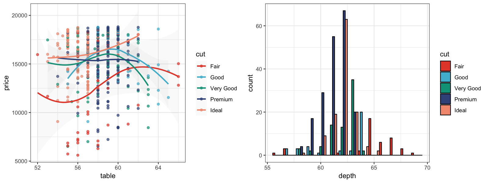

#### AAAS

The AAAS palette is inspired by the plots in the journals published by
<emph>American Association for the Advancement of Science</emph>:


```r
p1_aaas <- p1 + scale_color_aaas()
p2_aaas <- p2 + scale_fill_aaas()
grid.arrange(p1_aaas, p2_aaas, ncol = 2)
```

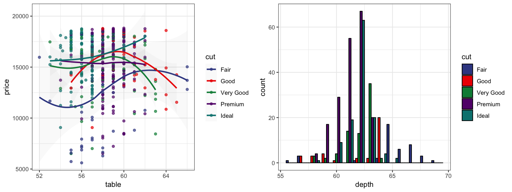

#### NEJM

The NEJM palette is inspired by the plots in
<emph>The New England Journal of Medicine</emph>:


```r
p1_nejm <- p1 + scale_color_nejm()
p2_nejm <- p2 + scale_fill_nejm()
grid.arrange(p1_nejm, p2_nejm, ncol = 2)
```

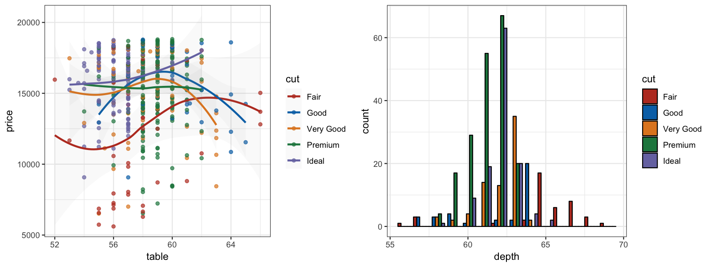

#### Lancet

The Lancet palette is inspired by the plots in <emph>Lancet</emph> journals,
such as <emph>Lancet Oncology</emph>:


```r
p1_lancet <- p1 + scale_color_lancet()
p2_lancet <- p2 + scale_fill_lancet()
grid.arrange(p1_lancet, p2_lancet, ncol = 2)
```

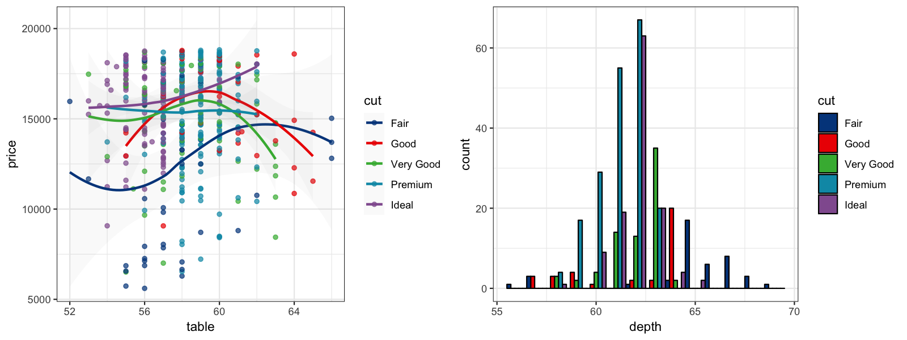

#### JAMA

The JAMA palette is inspired by the plots in
<emph>The Journal of the American Medical Association</emph>:


```r
p1_jama <- p1 + scale_color_jama()
p2_jama <- p2 + scale_fill_jama()
grid.arrange(p1_jama, p2_jama, ncol = 2)
```

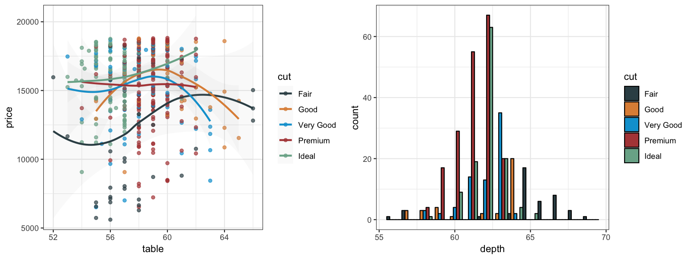

#### JCO

The JCO palette is inspired by the the plots in
<emph>Journal of Clinical Oncology</emph>:


```r
p1_jco <- p1 + scale_color_jco()
p2_jco <- p2 + scale_fill_jco()
grid.arrange(p1_jco, p2_jco, ncol = 2)
```

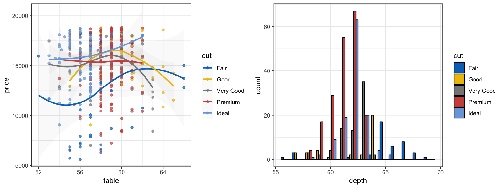

#### UCSCGB

The UCSCGB palette is from the colors used by
[UCSC Genome Browser](https://genome.ucsc.edu) for
representing chromosomes. This palette (interpolated, with alpha)
is intensively used in visualizations generated by Circos.


```r
p1_ucscgb <- p1 + scale_color_ucscgb()
p2_ucscgb <- p2 + scale_fill_ucscgb()
grid.arrange(p1_ucscgb, p2_ucscgb, ncol = 2)
```

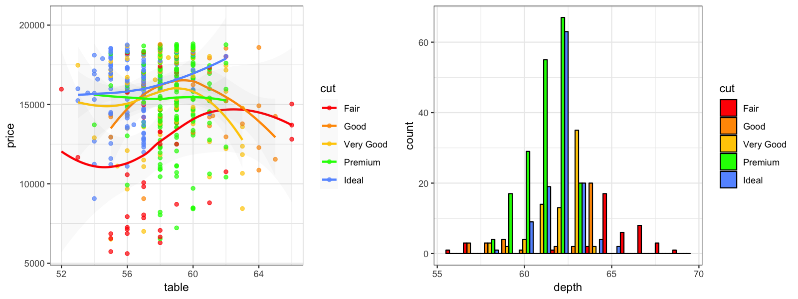

#### D3

The D3 palette is from the categorical colors used by
[D3.js](https://d3js.org) (version 3.x and before).
There are four palette types (`category10`, `category20`,
`category20b`, `category20c`) available.


```r
p1_d3 <- p1 + scale_color_d3()
p2_d3 <- p2 + scale_fill_d3()
grid.arrange(p1_d3, p2_d3, ncol = 2)
```

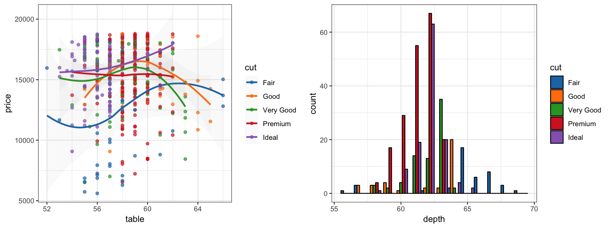

#### LocusZoom

The LocusZoom palette is based on the colors used by
[LocusZoom](http://locuszoom.org/).


```r
p1_locuszoom <- p1 + scale_color_locuszoom()
p2_locuszoom <- p2 + scale_fill_locuszoom()
grid.arrange(p1_locuszoom, p2_locuszoom, ncol = 2)
```

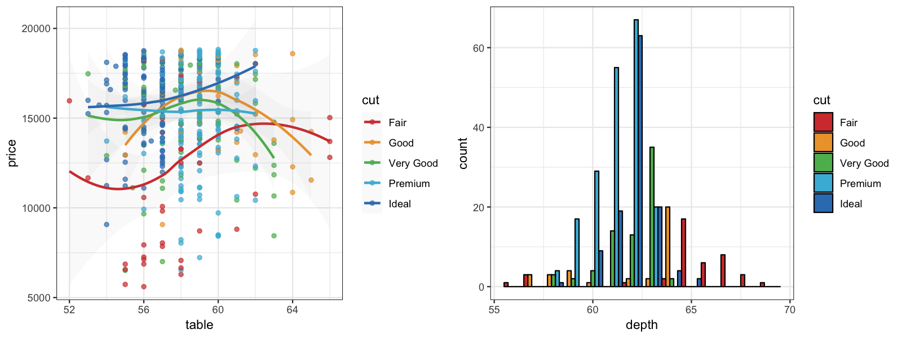

#### IGV

The IGV palette is from the colors used by
[Integrative Genomics Viewer](http://software.broadinstitute.org/software/igv/)
for representing chromosomes. There are two palette types
(`default`, `alternating`) available.


```r
p1_igv_default <- p1 + scale_color_igv()
p2_igv_default <- p2 + scale_fill_igv()
grid.arrange(p1_igv_default, p2_igv_default, ncol = 2)
```

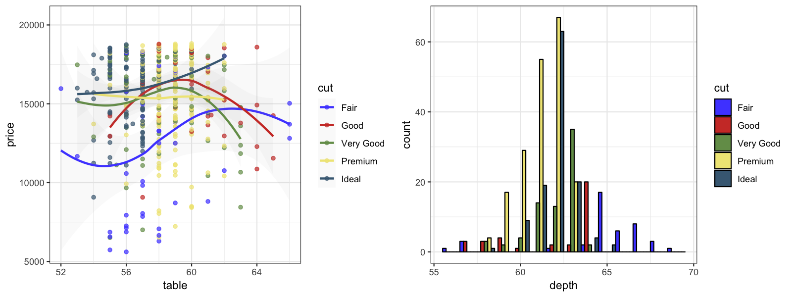

#### COSMIC

Color palettes inspired by the colors used in projects from the [Catalogue Of Somatic Mutations in Cancers (COSMIC)](https://cancer.sanger.ac.uk/cosmic).


```r
p1_cosmic_hallmarks_light <- p1 + scale_color_cosmic("hallmarks_light")
p2_cosmic_hallmarks_light <- p2 + scale_fill_cosmic("hallmarks_light")
grid.arrange(p1_cosmic_hallmarks_light, p2_cosmic_hallmarks_light, ncol = 2)
```

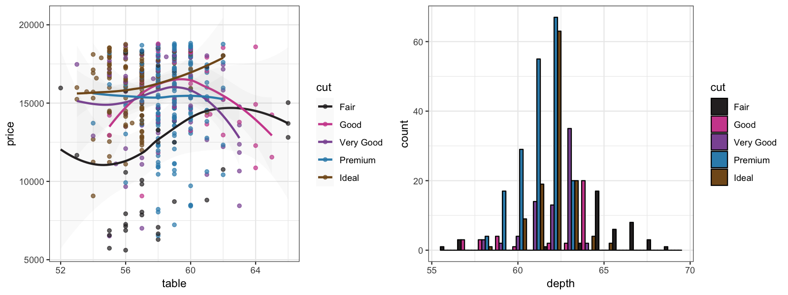


```r
p1_cosmic_hallmarks_dark <- p1 + scale_color_cosmic("hallmarks_dark")
p2_cosmic_hallmarks_dark <- p2 + scale_fill_cosmic("hallmarks_dark")
grid.arrange(p1_cosmic_hallmarks_dark, p2_cosmic_hallmarks_dark, ncol = 2)
```

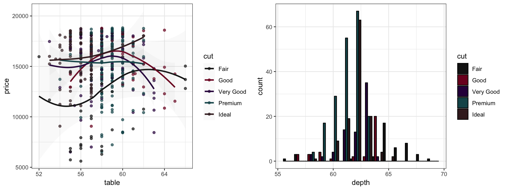


```r
p1_cosmic_signature <- p1 + scale_color_cosmic("signature_substitutions")
p2_cosmic_signature <- p2 + scale_fill_cosmic("signature_substitutions")
grid.arrange(p1_cosmic_signature, p2_cosmic_signature, ncol = 2)
```

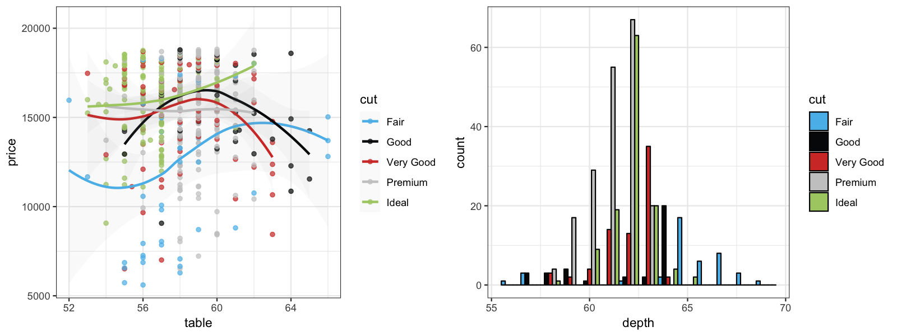

#### UChicago

The UChicago palette is based on
[the colors](https://news.uchicago.edu/sites/default/files/attachments/_uchicago.identity.guidelines.pdf)
used by the <emph>University of Chicago</emph>.
There are three palette types (`default`, `light`, `dark`) available.


```r
p1_uchicago <- p1 + scale_color_uchicago()
p2_uchicago <- p2 + scale_fill_uchicago()
grid.arrange(p1_uchicago, p2_uchicago, ncol = 2)
```

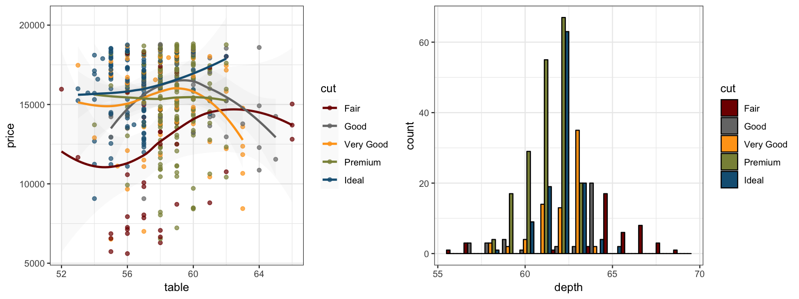

#### Star Trek

This palette is inspired by the (uniform) colors in <emph>Star Trek</emph>:


```r
p1_startrek <- p1 + scale_color_startrek()
p2_startrek <- p2 + scale_fill_startrek()
grid.arrange(p1_startrek, p2_startrek, ncol = 2)
```

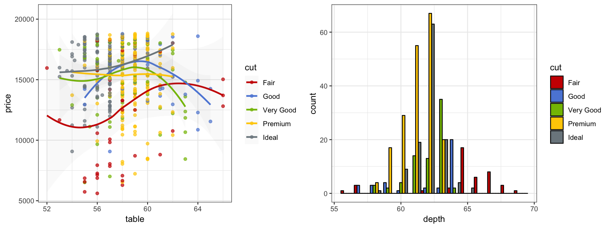

#### Tron Legacy

This palette is inspired by the colors used in <emph>Tron Legacy</emph>.
It is suitable for displaying data when using a dark theme:


```r
p1_tron <- p1 + theme_dark() + theme(
  panel.background = element_rect(fill = "#2D2D2D"),
  legend.key = element_rect(fill = "#2D2D2D")
) +
  scale_color_tron()
p2_tron <- p2 + theme_dark() + theme(
  panel.background = element_rect(fill = "#2D2D2D")
) +
  scale_fill_tron()
grid.arrange(p1_tron, p2_tron, ncol = 2)
```

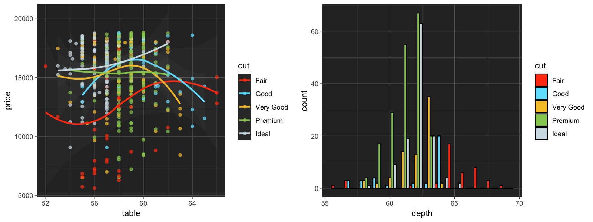

#### Futurama

This palette is inspired by the colors used in the TV show <emph>Futurama</emph>:


```r
p1_futurama <- p1 + scale_color_futurama()
p2_futurama <- p2 + scale_fill_futurama()
grid.arrange(p1_futurama, p2_futurama, ncol = 2)
```

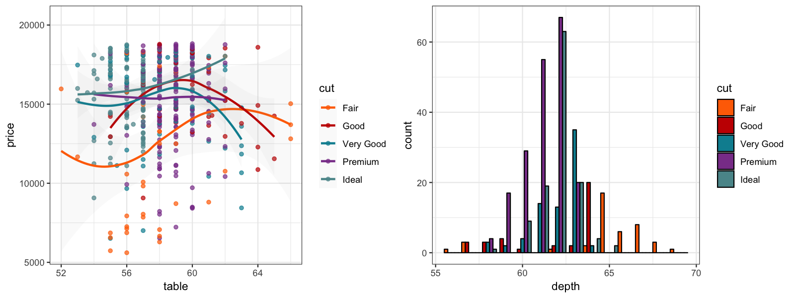

#### Rick and Morty

This palette is inspired by the colors used in the TV show <emph>Rick and Morty</emph>:


```r
p1_rickandmorty <- p1 + scale_color_rickandmorty()
p2_rickandmorty <- p2 + scale_fill_rickandmorty()
grid.arrange(p1_rickandmorty, p2_rickandmorty, ncol = 2)
```

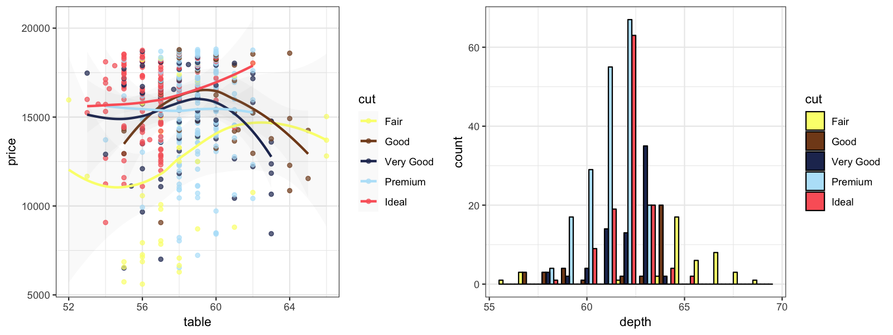

#### The Simpsons

This palette is inspired by the colors used in the TV show
<emph>The Simpsons</emph>:


```r
p1_simpsons <- p1 + scale_color_simpsons()
p2_simpsons <- p2 + scale_fill_simpsons()
grid.arrange(p1_simpsons, p2_simpsons, ncol = 2)
```

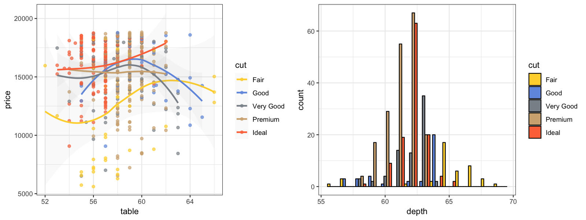

### Continuous Color Palettes

We will use a correlation matrix visualization (a special type of heatmap)
to demonstrate the continuous color palettes in `ChoppyReportR` color module.


```r
library("reshape2")

data("mtcars")
cor <- cor(unname(cbind(mtcars, mtcars, mtcars, mtcars)))
cor_melt <- melt(cor)

p3 <- ggplot(
  cor_melt,
  aes(x = Var1, y = Var2, fill = value)
) +
  geom_tile(colour = "black", size = 0.3) +
  theme_bw() +
  theme(
    axis.title.x = element_blank(),
    axis.title.y = element_blank()
  )
```

#### GSEA

The GSEA palette (continuous) is inspired by the heatmaps generated by
[GSEA GenePattern](https://software.broadinstitute.org/cancer/software/genepattern/).


```r
p3_gsea <- p3 + scale_fill_gsea()
p3_gsea_inv <- p3 + scale_fill_gsea(reverse = TRUE)
grid.arrange(p3_gsea, p3_gsea_inv, ncol = 2)
```

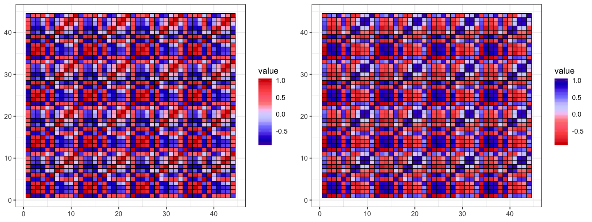

#### Material Design

The <emph>Material Design</emph> color palettes are from the [material design
color guidelines](https://material.io/guidelines/style/color.html).

We generate a random matrix first:


```r
library("reshape2")

set.seed(42)
k <- 9
x <- diag(k)
x[upper.tri(x)] <- runif(sum(1:(k - 1)), 0, 1)
x_melt <- melt(x)

p4 <- ggplot(x_melt, aes(x = Var1, y = Var2, fill = value)) +
  geom_tile(colour = "black", size = 0.3) +
  scale_x_continuous(expand = c(0, 0)) +
  scale_y_continuous(expand = c(0, 0)) +
  theme_bw() + theme(
    legend.position = "none", plot.background = element_blank(),
    axis.line = element_blank(), axis.ticks = element_blank(),
    axis.text.x = element_blank(), axis.text.y = element_blank(),
    axis.title.x = element_blank(), axis.title.y = element_blank(),
    panel.background = element_blank(), panel.border = element_blank(),
    panel.grid.major = element_blank(), panel.grid.minor = element_blank()
  )
```

Plot the matrix with the 19 material design color palettes:


```r
grid.arrange(
  p4 + scale_fill_material("red"), p4 + scale_fill_material("pink"),
  p4 + scale_fill_material("purple"), p4 + scale_fill_material("deep-purple"),
  p4 + scale_fill_material("indigo"), p4 + scale_fill_material("blue"),
  p4 + scale_fill_material("light-blue"), p4 + scale_fill_material("cyan"),
  p4 + scale_fill_material("teal"), p4 + scale_fill_material("green"),
  p4 + scale_fill_material("light-green"), p4 + scale_fill_material("lime"),
  p4 + scale_fill_material("yellow"), p4 + scale_fill_material("amber"),
  p4 + scale_fill_material("orange"), p4 + scale_fill_material("deep-orange"),
  p4 + scale_fill_material("brown"), p4 + scale_fill_material("grey"),
  p4 + scale_fill_material("blue-grey"),
  ncol = 6
)
```

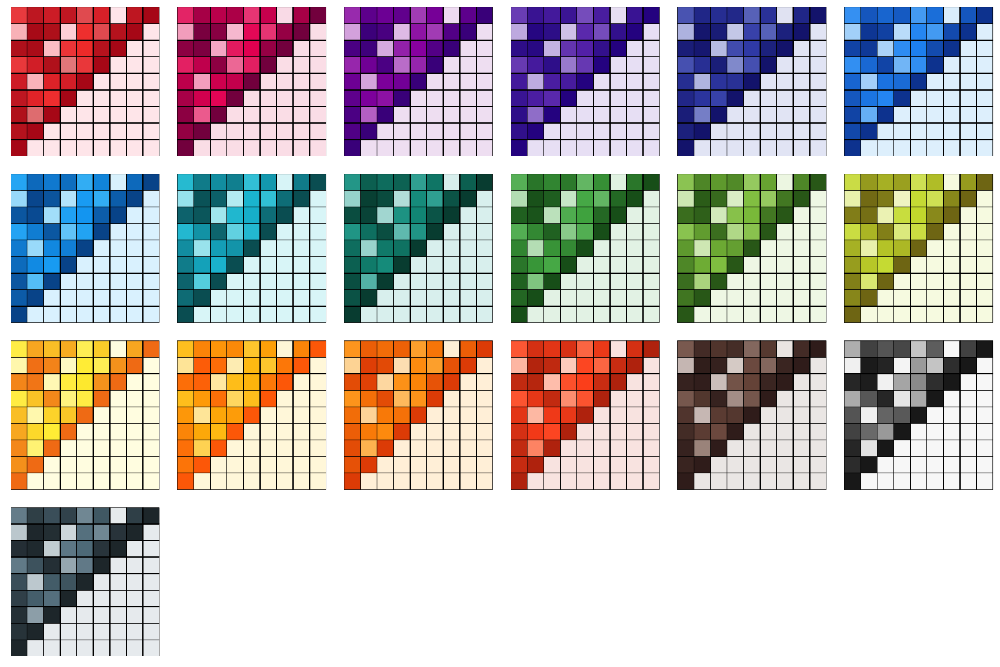

From the figure above, we can see that even though an identical matrix
was visualized by all plots, some palettes are more preferrable
than the others because our eyes are more sensitive to the changes
of their saturation levels.

### Non-ggplot2 Graphics

To apply the color palettes in `ChoppyReportR` color module to other graphics systems
(such as base graphics and lattice graphics), simply use the
palette generator functions in the table above. For example:


```r
mypal <- pal_npg("nrc", alpha = 0.7)(9)
mypal
```

```
## [1] "#E64B35B2" "#4DBBD5B2" "#00A087B2" "#3C5488B2" "#F39B7FB2" "#8491B4B2"
## [7] "#91D1C2B2" "#DC0000B2" "#7E6148B2"
```

```r
library("scales")
show_col(mypal)
```

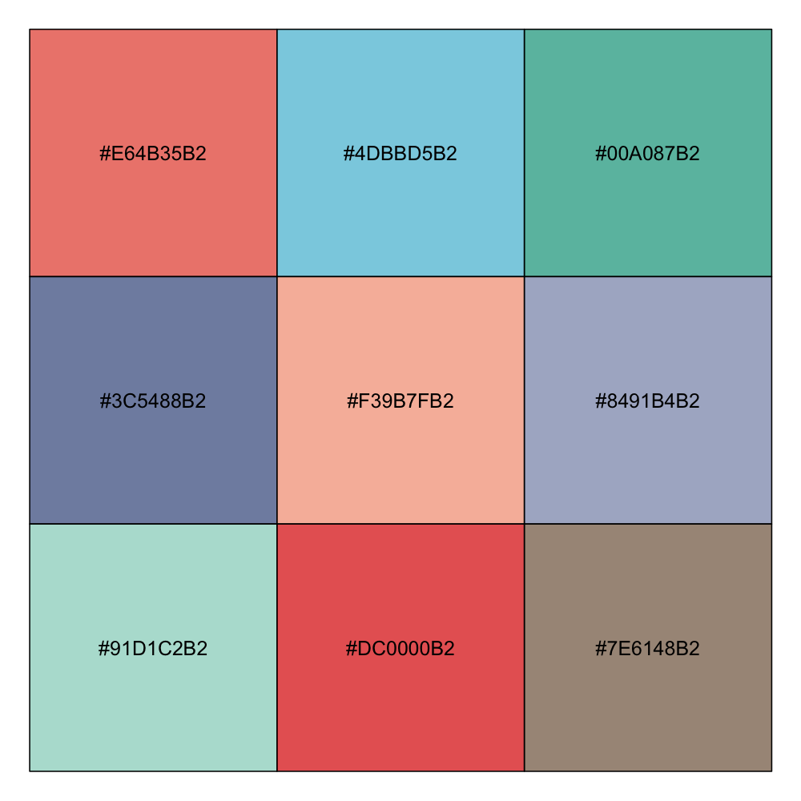

You will be able to use the generated hex color codes for such
graphics systems accordingly. The transparent level of the
entire palette is easily adjustable via the argument `"alpha"`
in every generator or scale function.

### Discussion

Please note some of the palettes might not be the best choice for certain
purposes, such as color-blind safe, photocopy safe, or print friendly.
If you do have such considerations, you might want to check out
color palettes like [ColorBrewer](http://colorbrewer2.org)
and [viridis](https://cran.r-project.org/package=viridis).

The color palettes in this package are solely created for research purposes.
The authors are not responsible for the usage of such palettes.
